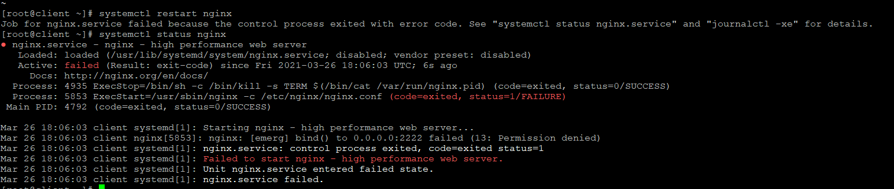
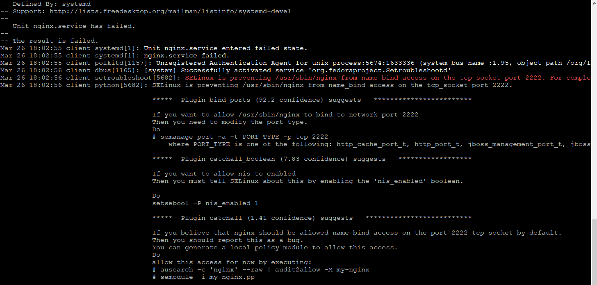
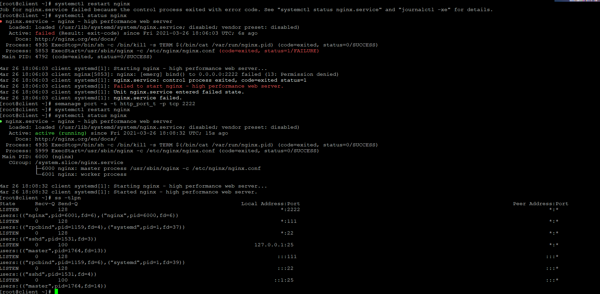
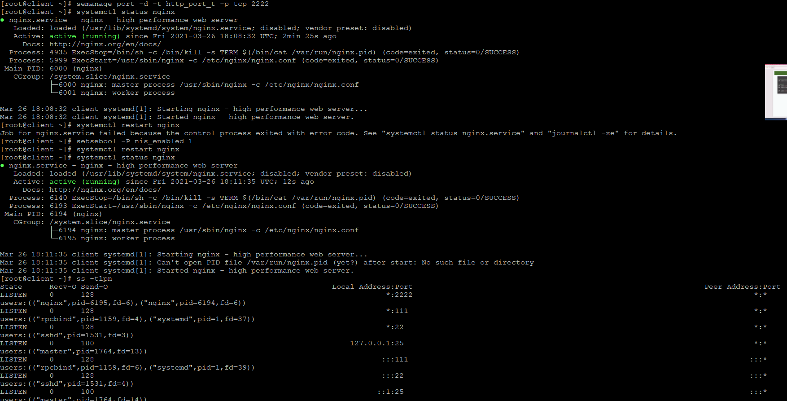
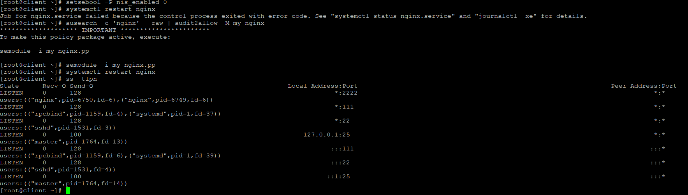
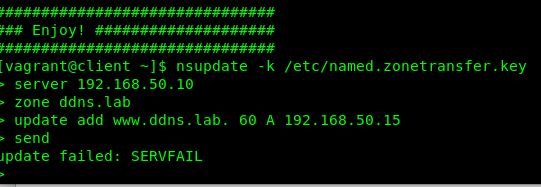
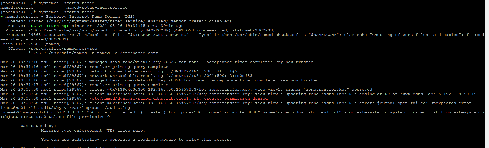
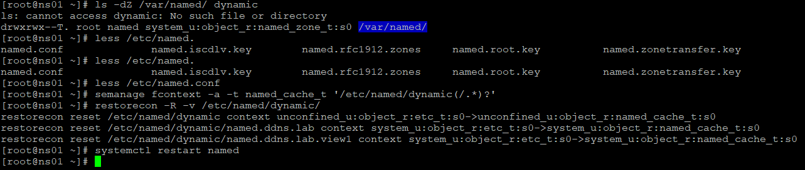
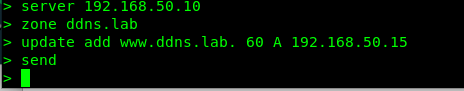

# ДЗ по SELinux

#### Запустить nginx на нестандартном порту 3-мя разными способами

Снчала устанавливаем nginx
	sudo yum install yum-utils
	sudo sudo yum install nginx

Меняем порт по умолчанию с 80 на 2222

	vim /etc/nginx/conf.d/default.conf

рестартуем nginx и получаем ошибку:

смотрим в journalctl и получаем описание и варианты решения проблемы даже без audit2why и sealert:

	
##### Вариант решения номер один, это добавить порт 2222 для веб-сервера

##### Вариант решения номер два, это включить булевую политику nis_enabled
 

 
##### Вариант решения номер три, это создать модуль для selinux

#### SELinux: проблема с удаленным обновлением зоны DNS

Обнуляем audit.log

	echo > /var/log/audit/audit.log

На клиенте пробуем внести запись в DNS, получаем ошибку.

	
идём на DNS сервер и смотрим статус named и ошибки в audit.log.

	
Из ошибок видим, что selinux не даёт создать файл /etc/named/dynamic/named.ddns.lab.view1.jnl.

Выполняем

	sealert -a /var/log/audit/audit.log
	
sealert предлагает следующие варианты:

	semanage fcontext -a -t FILE_TYPE 'named.ddns.lab.view1.jnl'
	restorecon -v 'named.ddns.lab.view1.jnl'

	ausearch -c 'isc-worker0000' --raw | audit2allow -M my-iscworker0000
	semodule -i my-iscworker0000.pp
	
смотрим в man named и видим, что:

	Any file created in the zone database file directory is automatically assigned the SELinux file context named_zone_t .

	By default, SELinux prevents any role from modifying named_zone_t files; this means that files in the zone database directory cannot be modified by dynamic DNS (DDNS) updates or zone transfers.

	The Red Hat BIND distribution and SELinux policy creates three directories where named is allowed to create and modify files: /var/named/slaves, /var/named/dynamic /var/named/data. By placing files you want named to modify, such as slave or DDNS updateable zone files and database / statistics dump files in these directories, named will work normally and no further operator action is required. Files in these directories are automatically assigned the 'named_cache_t' file context, which SELinux allows named to write.

Т.е. named пытается создать файл с контекостом named_zone_t, а директории куда о пытается писать имеют контекст named_cache_t. Проверяем:
	   
	[root@ns01 ~]# ls -Z /var/named/ |grep dynamic
	drwxrwx---. named named system_u:object_r:named_cache_t:s0 dynamic
	
Меняем контекст директории и перезапускаем сервис:

	
Пробуем сделать запись в DNS

	
Готово.
